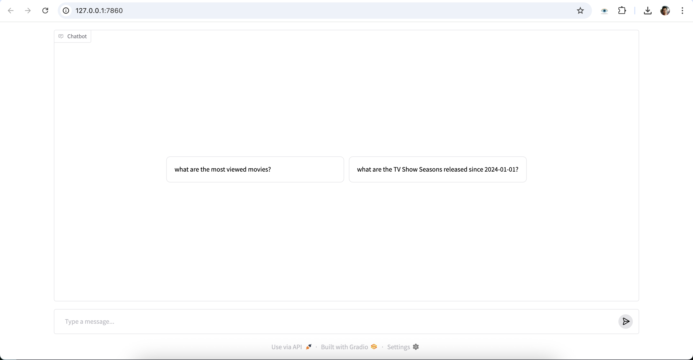

# Overview

Sample text-to-sql chatbot that can answer questions about Netflix movies by dynamically querying a SQLite db using Python, ChatGPT, LangGraph and LangChain's `SQLDatabaseToolkit` based on LangChain's sample [SQL Agent](https://langchain-ai.github.io/langgraph/tutorials/sql-agent/).




## Technology Stack

- **[LangChain](https://langchain.com/)**: An opens-source framework that helps developers build applications powered by large language models (LLMs)
- **[LangGraph](https://langgraph.dev/)**: An opens-source framework by LangChain for building and managing complex AI agents using graph-based architecture
- **[ChatGPT](https://openai.com/chatgpt)**: A popular LLM provided by OpenAI
- **[Gradio](https://gradio.app/)**: A popular opens-source library for building web interfaces for machine learning models. This project uses Gradio to create a web interface for the chatbot.
- **[LangSmith](https://smith.langchain.com/)**: An opens-source framework by LangChain for tracing and monitoring LLM applications.
- **[uv](https://github.com/conda-forge/uv)**: A fast opens-source Python package manager - a drop-in replacement for `pip`, `conda` and `virtualenv`.

## Setup

### 1. Install uv

Follow the instructions here to install uv, if you haven't already.

### 2. Install Dependencies

```bash
uv sync
```

### 3. Set Up OpenAI API Key

Create a .env file in the project root:

```bash
# .env
OPENAI_API_KEY=your-openai-api-key-here
```

For tracing using LangSmith [create a free account and API key](https://docs.smith.langchain.com/administration/how_to_guides/organization_management/create_account_api_key) and include these environment variables in the `.env` file:

```bash
LANGSMITH_TRACING=true
LANGSMITH_API_KEY=your-langsmith-api-key
```

### 4. Download DB script

```bash
curl -L -o netflixdb.sqlite https://github.com/lerocha/netflixdb/releases/download/v1.0.9/netflixdb.sqlite
```

### 5. Run the chatbot

```bash
uv run main.py
```

Try the chatbot here: [http://127.0.0.1:7860/](http://127.0.0.1:7860/).

Example questions:

- "what are the most viewed movies?"
- "what are the TV Show Seasons released since 2024-01-01?"
